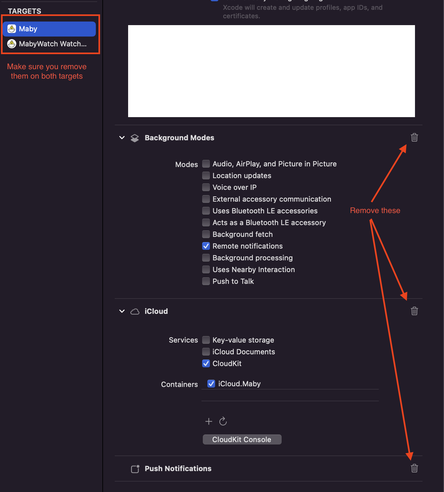
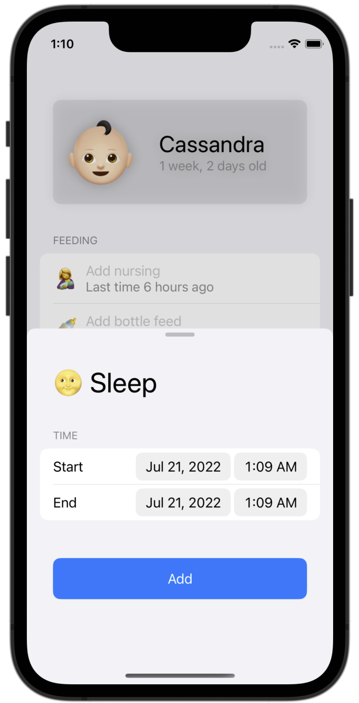
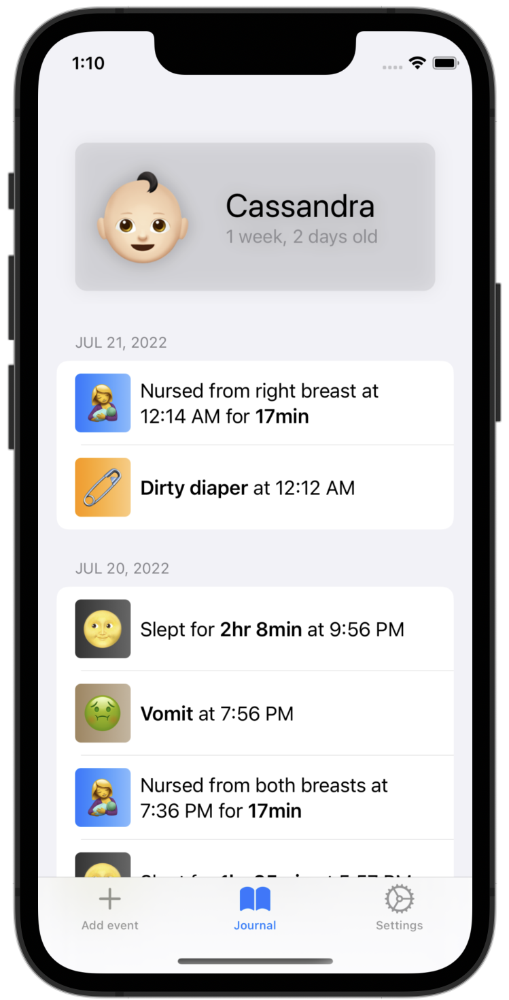
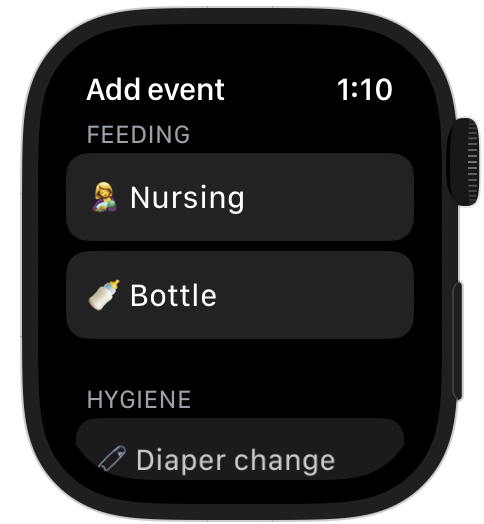
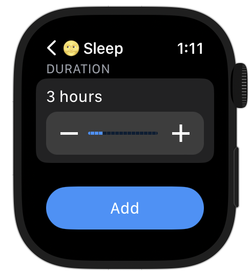

# 🐣 Maby

Maby is an iOS/watchOS open-source app to help you keep track of your baby's sleep, feedings, diaper changes and more to avoid the constant questions like _"how many times did my baby pee today? Was it 5 or 6?"_

## ⚙️ Building

The app was fully developed on Xcode 14 and includes a single-target watchOS app that as far as I know is not compatible with any lower version of Xcode, so you'll need the latest version of Xcode 14 to build it. Afterwards simply clone the repo and open!

```bash
git clone https://github.com/sleepyfran/maby/
```

And open the main project!

### ❗️ Important

The app uses CloudKit to sync all the data, so a **paid** developer account is needed. Alternatively if you want to build locally and you don't need CloudKit, you can simply remove the cloud capabilities by clicking in the top "Maby" project inside of Xcode and removing them as follows:



And in the `Persistence.swift` file inside of `MabyKit`, change `NSPersistentCloudKitContainer` to `NSPersistentContainer`. The app will then hopefully build correctly 🙂

## 🏞 Show me!

The app consist in a main iOS app that allows for adding events and visualizing them through a journal:

<div float="left">
	
	
</div>
</br>
And a companion watchOS app that has the ability to add new entries to the main app:

<div float="left">
	
	
</div>

_(This one comes super in-handy during nights, trust me)_

## ⬇️ Where can I get it?

Currently the app is waiting for public release approval, once done there'll be a TestFlight URL over here. In the meantime you can either compile it yourself following the steps above or contact me personally so that I can add you to the invitation list 🙂

## 😀 Contributions/feedback

Feel free to submit any ideas or feedback you have through the issues here on GitHub. Before you create a PR, please also create an issue so that we can discuss potential solutions and whether what you're about to implement is an actual feature that we want added to the app.
